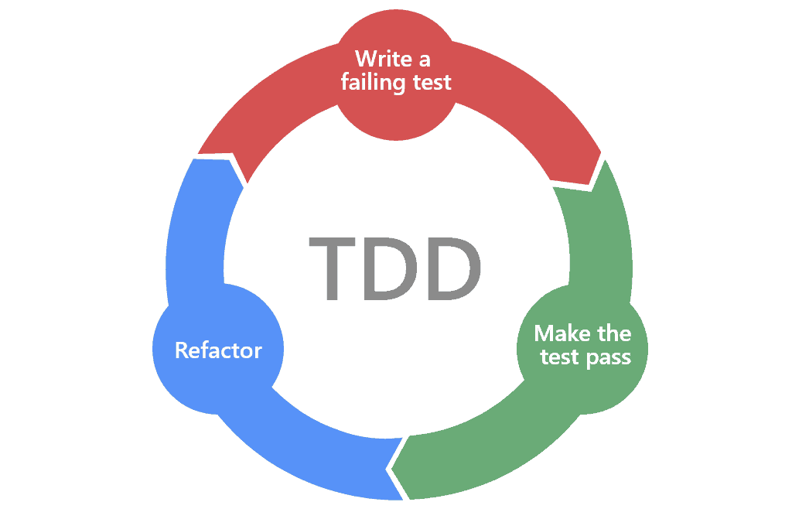

# Kill process

我们大家在开发的时候，可能遇到过这种情况，想要启动一个开发服务器，执行完服务启动命令之后，系统却提示你监听的端口号已经被占用了
虽然修改一下端口号不是很麻烦，但就是很不爽，所以就想着有没有一个工具来将占用端口的进程给直接干掉。

有了这么个需求，当然要发挥程序员的主观能动性，自己实现它啦。刚好最近又看了一些关于 TDD 的资料，趁这个机会也实践一下，毕竟纸上得来终觉浅，绝知此事要躬行。

## 什么是TDD
TDD，也就是测试驱动开发(Test-Driven development)，是一种“测试先行”的程序设计方法论，其基本流程围绕着测试->编码（重构）->测试的循环展开。

TDD有三个重要的原则:
1. 除非为了通过一个单元测试，否则不允许编写任何产品代码。
2. 在一个单元测试中只允许编写刚好能够导致失败的内容。
3. 一次只能写通过一项单元测试的产品代码，不能多写。

> 1. You are not allowed to write any production code unless it is to make a failing unit test pass.
> 2. You are not allowed to write any more of a unit test than is sufficient to fail; and compilation failures are failures.
> 3. You are not allowed to write any more production code than is sufficient to pass the one failing unit test.

根据TDD三原则，开发过程如下图



在我们的需求开发过程中将遵循上述原则，来展示如何使用TDD开发我们的应用

## 需求分析

在正式开始编码前，我们先对需求做个分析，梳理一下整个流程，并确定我们开发的业务重点。
那我们的需求是什么呢？具体来说，是检查用户所输入的端口号，如果这个端口号被占用了，就显示占用的进程信息，并询问用户是否结束这个进程。

根据需求的描述，需求的业务流程如下：

1. 用户输入端口号
2. 根据端口号获取占用的进程信息
3. 显示信息并提示用户是否结束进程
4. 根据用户选择，结束用户进程并退出程序或是直接退出

## 整理测试用例

根据 TDD 三原则，在开始编写代码前需要先写测试，所以我们需要先整理出测试用例，在对当前组件需求梳理一遍后，我们整理出如下测试用例：

1. 如果用户输入端口号不是数字，应该返回提示信息
2. 如果没有找到对应端口的占用进程，应该返回提示信息
3. 如果找到对应端口的占用进程，应该返回进程信息
4. 如果用户选择结束进程，应该结束该进程并退出程序
5. 如果用户选择直接退出，应该直接退出程序

用例梳理好了，我们就可以准备开始编码了

## 前期准备

我们使用 typescript 来开发这个程序，使用 jest 来进行测试，所以先执行 `npm init -y`来初始化我们的项目工作区，然后添加相关的依赖

```base
npm i typescript jest ts-jest @types/jest --dev
```

生成 typescript 配置文件

```
npx typescript --init
```

因为使用了 ts 来开发，所以我们使用 ts-jest 这个 jest 插件来生成配置

```
npx ts-jest config:init
```

修改 package.json 文件

```diff
  "scripts": {
+    "test": "jest"
-    "test": "echo \"Error: no test specified\" && exit 1"
  },
```

在根目录新建 src 文件夹并修改 tsconfig.json 文件

```diff
{
  ... other code

+  "include": ["./src/**/*.ts"]
}
```

这样我们的前期准备工作就完成了。

## 分析依赖，建立抽象接口

接下来我们分析需求与测试用例，识别其中的依赖，并对其建立抽象接口。一般来说我们可以将最容易抽象的依赖 ————网络，I/O 以及中间件等外部依赖抽象成接口。

我们的程序在运行时需要接收用户的命令行输入，并输出文本提示，还需要通过执行外部命令来获取端口号占用进程信息与结束进程，那么抽象出对应的 Input Output 以及 Command 接口，在使用 ProcessInfo 这个接口来描述进程信息的数据结构。

在 src 文件夹内新建 interfaces.ts 文件然后定义以下接口

```ts
//interfaces.ts
export interface Input {
  receive(): Promise<string>;
}

export interface Output {
  write(text: string): Promise<void>;
}

export interface Command {
  findProcessByPort(port: number): ProcessInfo | null;

  killProcess(process: ProcessInfo): void;
}

export interface ProcessInfo {
  pid: number;
  name: string;
}
```

在 src 文件夹新建 handler.ts, 然后定义 Handler 类，通过构造函数将依赖的接口注入

```ts
// handler.ts
import { Command, Input, Output } from "./interfaces";

export class Handler {
  private input: Input;
  private output: Output;
  private command: Command;

  constructor(input: Input, output: Output, command: Command) {
    this.input = input;
    this.output = output;
    this.command = command;
  }

  async handle(): Promise<void> {}
}
```

## 编写测试->测试失败->编码->通过测试->重构

现在一切准备就绪，可以写我们的第一个测试了

### 1.写测试
```ts
describe("Handler", () => {
  test("should output tips if user input value not number", async () => {
    const input: jest.Mocked<Input> = {
      receive: jest.fn()
    };
    const output: jest.Mocked<Output> = {
      write: jest.fn()
    };
    const command: jest.Mocked<Command> = {
      findProcessByPort: jest.fn(),
      killProcess: jest.fn()
    };
    const handler = new Handler(input, output, command);

    input.receive.mockResolvedValue("1024a");

    await handler.handle();

    expect(output.write).toBeCalledWith("端口号应该为纯数字，请输入有效的端口号");
  });
});
```
### 2.编写代码
注意我们只需要编写刚好能让测试通过的代码

```ts
export class Handler {
  /// 省略其他代码
  async handle(): Promise<void> {
    const inputStr = await this.input.receive();
    const port = Number(inputStr);

    if (Number.isNaN(port)) {
      await this.output.write("端口号应该为纯数字，请输入有效的端口号");
      return;
    }
  }
}
```

### 3.通过测试

运行 `npm run test`

```base
PASS  src/handler.test.ts
  Handler
    √ should output tips if user input value not number (8 ms)

Test Suites: 1 passed, 1 total
Tests:       1 passed, 1 total
Snapshots:   0 total
Time:        2.762 s, estimated 3 s
Ran all test suites.
```
### 4.继续写测试
很好！测试顺利通过了，接下来是第二个测试

```ts
// handler.test.ts
test("should output tips message if port not be use", async () => {
  const input: jest.Mocked<Input> = {
    receive: jest.fn()
  };
  const output: jest.Mocked<Output> = {
    write: jest.fn()
  };
  const command: jest.Mocked<Command> = {
    findProcessByPort: jest.fn(),
    killProcess: jest.fn()
  };
  const handler = new Handler(input, output, command);

  input.receive.mockResolvedValue("1024");
  command.findProcessByPort.mockReturnValue(null);

  await handler.handle();

  expect(command.findProcessByPort).toBeCalledWith(1024);
  expect(output.write).toBeCalledWith("端口号:1024 未被使用");
});
```

同样我们编写代码通过测试

```ts
// handler.ts Handler.handle
const processInfo = this.command.findProcessByPort(port);

if (processInfo === null) {
  await this.output.write(`端口号:${port} 未被使用`);
  return;
}
```

```
PASS  src/handler.test.ts
  Handler
    √ should output tips if user input value not number
    √ should output tips message if port not be use (1 ms)

Test Suites: 1 passed, 1 total
Tests:       2 passed, 2 total
Snapshots:   0 total
Time:        0.364 s, estimated 1 s
Ran all test suites related to changed files.
```

### 5.重构
现在回头检查一下我们的测试文件，发现代码散发着腐烂的坏味道，我们重复了两次一摸一样的测试类构造过程，是时候重构了。

```ts
const makeSut = () => {
  const input: jest.Mocked<Input> = {
    receive: jest.fn()
  };
  const output: jest.Mocked<Output> = {
    write: jest.fn()
  };
  const command: jest.Mocked<Command> = {
    findProcessByPort: jest.fn(),
    killProcess: jest.fn()
  };
  const handler = new Handler(input, output, command);

  return {
    input,
    output,
    command,
    handler
  };
};

describe("Handler", () => {
  let input: jest.Mocked<Input>;
  let output: jest.Mocked<Output>;
  let command: jest.Mocked<Command>;
  let handler: Handler;

  // 每次执行test之前都会调用
  beforeEach(() => {
    const sut = makeSut();
    input = sut.input;
    output = sut.output;
    command = sut.command;
    handler = sut.handler;
  });

  test("should output tips if user input value not number", async () => {});

  test("should output tips message if port not be use", async () => {});
});
```

测试代码也属于源码的一部分，也应该不断的进行重构，否则随着测试的增多，腐坏的味道将散发到整个项目。
接下来只要不断编写测试，紧接着编写业务代码让测试通过，查找代码里的坏味道并重构，如此循环，直到所有的测试用例都通过。完整的测试用例请查看源码，就不在此展开。

## 总结

